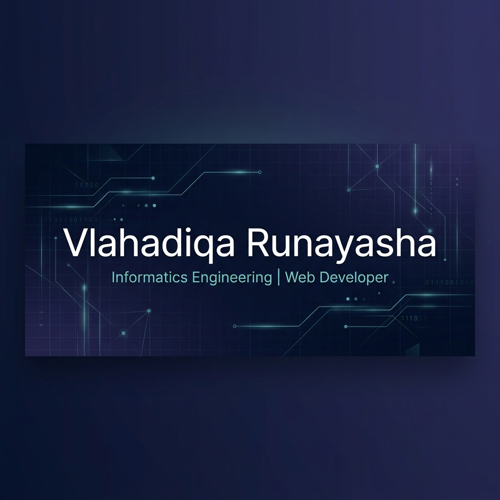

# Hi there! I'm Vlahadiqa Runayasha 👋

  

I am an **Informatics Engineering (Teknik Informatika)** student at **Universitas Muhammadiyah Surabaya**, focusing on Web Development and software engineering. I am passionate about building modern, clean, and user-centric web applications, writing efficient code, and solving real-world problems.

---

### 💫 About Me

- 🎓 Informatics Engineering Student at **Universitas Muhammadiyah Surabaya**
- 💻 Specialized in **Web Development** (Frontend & Backend integrations)
- ⚽ Former student-athlete representing Central Kalimantan in **Gala Siswa Indonesia (GSI) 2020**
- 📍 Based in Surabaya / Sampit, Indonesia

---

### 🛠️ Tech Stack & Tools

#### 📝 Languages

  
  
  

#### ⚙️ Back End & API

  
  
  

#### 🔧 Tools & Platforms

  
  
  

---

### 🚀 Featured Projects

#### 🌐 [QuranLink](https://github.com/vlahadiqa/QuranLink)
> A web application designed to connect and explore Quranic verses with an intuitive, clean, and responsive user experience.
- **Tech Stack**: HTML5, CSS3, JavaScript

#### 🌾 [SAFE-GRAIN-BERAS](https://github.com/vlahadiqa/SAFE-GRAIN-BERAS)
> An inventory monitoring system built to track and manage grain and rice storage conditions safely and efficiently.
- **Tech Stack**: HTML5, CSS3, JavaScript

#### 💰 [Modalin App](https://github.com/vlahadiqa) *(Ongoing)*
> A micro-funding web application aimed at empowering local small businesses (UMKM) through financial resource connection.
- **Tech Stack**: JavaScript, Node.js, REST APIs

---

### 📊 Most Used Languages

  

---

### 🤝 Connect with Me

  
  

